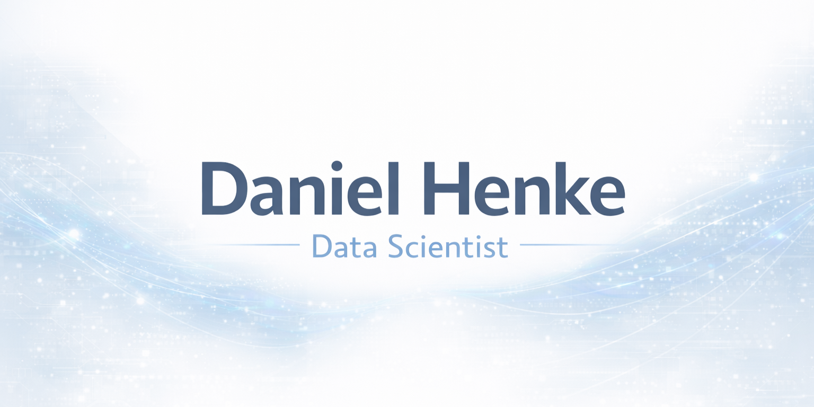

  <picture>
    <source media="(prefers-color-scheme: dark)" srcset="assets/banner-dark.png">
    <source media="(prefers-color-scheme: light)" srcset="assets/banner-light.png">
    
  </picture>

  <h1>Hi, I'm Daniel Henke 👋</h1>
  
Data Science & AI • Process Mining • Value-focused automation

  
  

---

### 👇 About me
- 🧭 I help teams turn **data + AI** into measurable outcomes—responsibly and repeatably.
- 🧪 Current interests: **Copilot/AI agents**, **process mining**, and **RL environments** for policy/econ simulations (EU ETS).
- 💼 Currently contributing at **Microsoft** in Denmark (student/working-student capacity); previously **ex‑Celonis** (process mining).
- 🎓 M.Sc. in Data Science (CBS) • EN/DE speaker • based in Copenhagen.

### 🛠️ Toolbox

  
  
  
  
  
  
  

### 🔬 Focus areas
- **Copilot/AI adoption**: design → workshop → measurable value (usage, time saved, quality).
- **Process mining**: from event logs to operational change; Celonis-style value cases.
- **RL & simulation**: sandboxing market/policy behaviors (EU ETS focus for power sector).
- **Reporting**: pragmatic automation with Python + Power BI.

📈 GitHub stats

  

🧩 Recent/typical work

- **ETS RL environment**: research prototype to explore incentive design & environmental performance for electricity companies.

---

### 📬 Connect
The easiest way to reach me is via **LinkedIn**: https://www.linkedin.com/in/daniel-henke/
